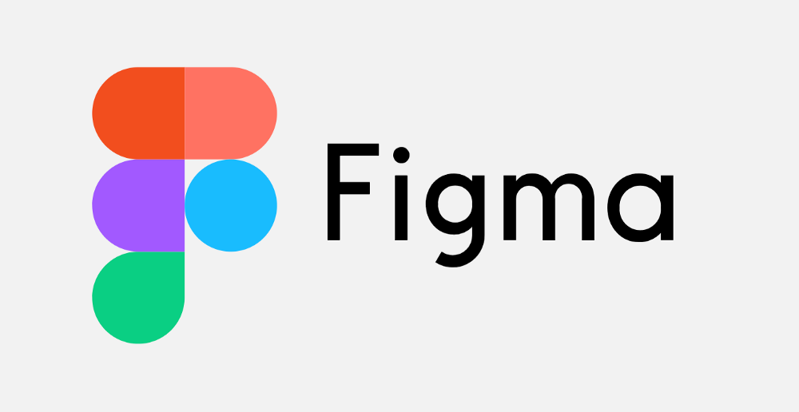
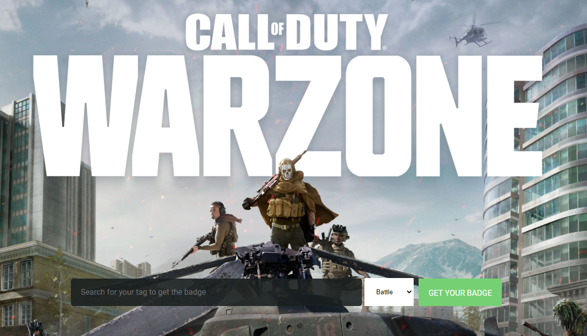
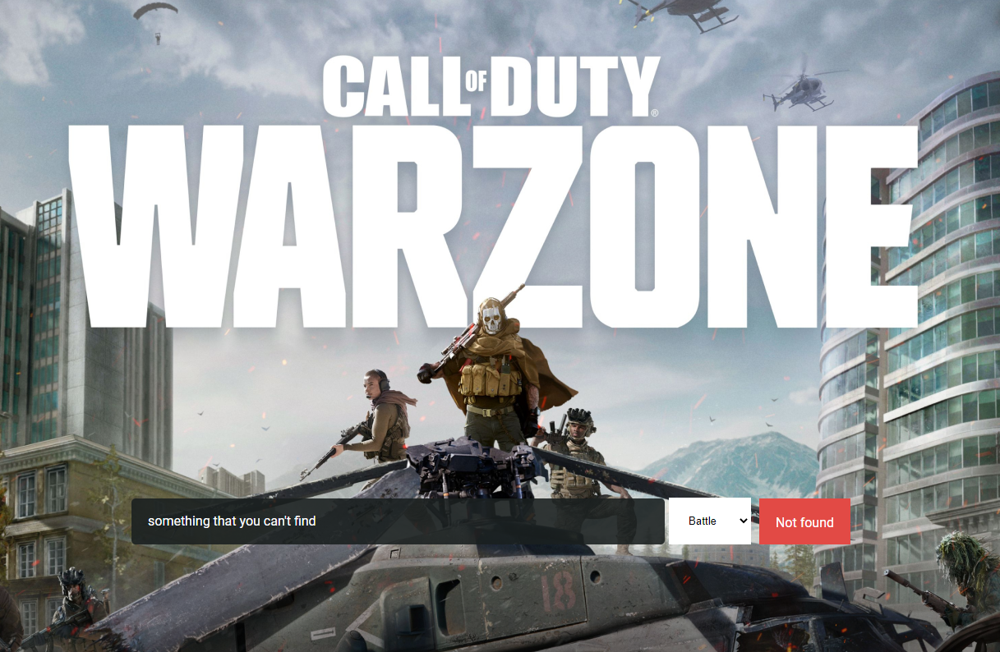
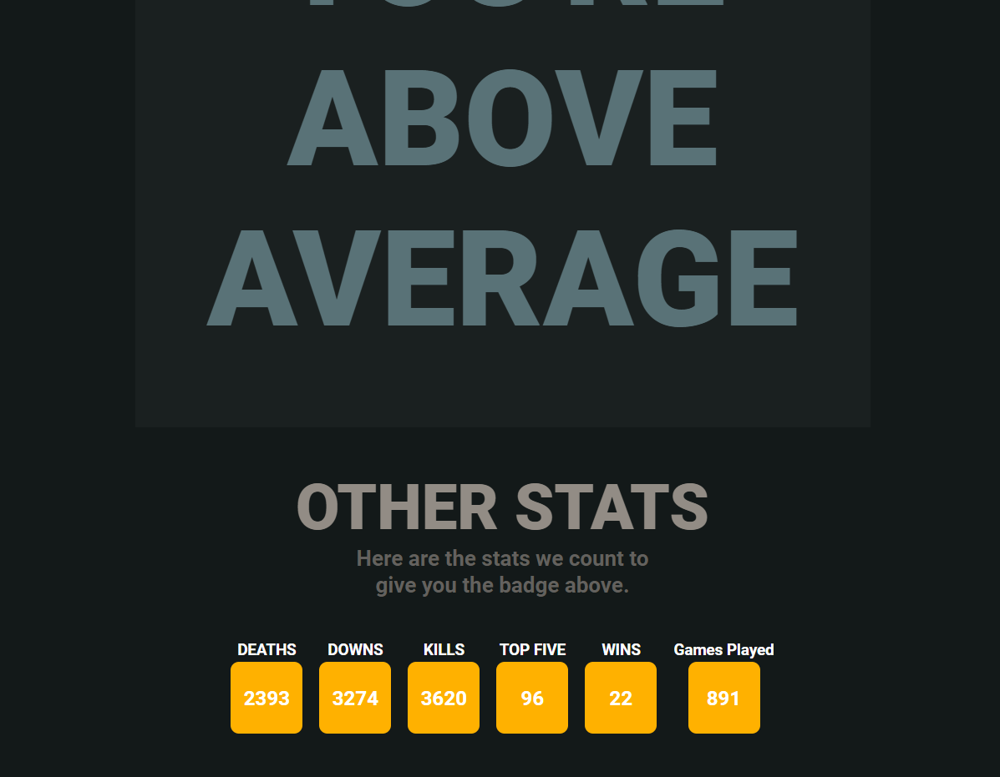

---
<br>
<h1 align="center">
    
    
</h1>

<h3 align="center"> A front-end made with ReactJS that gets data from the Call of Duty platform and gives you a badge based on your skills. </h3>


---

I develop this frontend do fetch data from Call of Duty API. It gets your Battle.net scores and gives you a  badge based on your stats. This is my first approach using styled-components with ReactJS. I also made a simple express server to fetch data from the server-side and then send it to the frontend because of the security needed to access Activision API.


### UI/UX 

I also developed the UI/UX from this project. The prototype can be found 


[](https://www.figma.com/file/xWhVEJSAZDLD7G7gOtKtq0/warzone-stats?node-id=0%3A1 "Redirect to homepage")


  
###


### Techs used
This application was made using this the following Techs:
- [Node.js](https://nodejs.org/en/)
- [Express](https://expressjs.com/pt-br/)
- [React](https://pt-br.reactjs.org/)
- [Node-CallOfDuty](https://github.com/Lierrmm/Node-CallOfDuty)
- [styled-components](https://styled-components.com/)
- [Typescript](https://www.typescriptlang.org/)


  
###


### ⚙ How to setup project

This project have two "parts"

1. Backend(mini)
2. Frontend


### Requirements

Tools needed:
<b>[Git](https://git-scm.com)</b>

<b>[Node.js](https://nodejs.org/en/)</b>


### 🧭 How to run the backend:

```bash
# Clone this repo
$ git clone https://github.com/rossignolli/warzone-stats

# Go to the main folder and run
$ npm install or yarn add

# Don't forget to create .env file with yours credentials
USER=youemailhere@mail.com
PASSWORD=mysupersecretpassword

# run the application
$ node index.js

# server will start on :3333 - go to http://localhost:3333 
```

### 🧭 How to run the frontend:

```bash
# Go to web/
$ npm install or yarn add
# Run
$ yarn start

```


## Screens


<p align="center">
    
</p>


<p align="center">
    
    
    
</p>


### 📱 My social Media

Let's chat?

<p align="center">

  
  <a href="https://instagram.com/cvigarani" target="_blank" >
    </a> 
  
  <a href="https://www.facebook.com/vitor.rossignolli" target="_blank" >
    </a> 

  <a href="https://www.linkedin.com/in/vitor-vigarani-1947a7191//" target="_blank" >
    </a> 
  
  <a href="mailto:vitorrossignolli@gmail.com" target="_blank" >
    </a> 

</p>

---

Feito com ❤️ by **Vitor :)**
